# CLARITY — System Architecture

## Overview

CLARITY is a layered, deterministic evaluation instrument. Each layer has a single responsibility and communicates through a frozen contract boundary.

---

## Architecture Diagram

```mermaid
flowchart TD
    GOV["🏛️ RediAI Governance\nArchitectural contracts\nMilestone discipline\nScope freeze"]

    R2L["⚙️ R2L Engine\nDeterministic micro-lab generator\nSeed-controlled execution\nArtifact bundling + SHA sealing"]

    CLARITY["🔬 CLARITY Instrument\nPerturbation sweep orchestration\nMetrics computation\nSurface estimation\nCounterfactual probe"]

    ADAPTER["🔌 Model Adapter\nThin interface boundary\nPluggable model support\nRich-mode evidence extraction"]

    MEDGEMMA["🧠 MedGemma 4B-IT\ngoogle/medgemma-4b-it\nMultimodal clinical reasoning\nToken-level logit access"]

    GPU["⚡ RTX 5090\n32 GB VRAM\nCUDA deterministic mode\nOffline / air-gapped"]

    METRICS["📊 Robustness Surfaces\nESI — Evidence Sensitivity Index\nCSI — Confidence Stability Index\nEDM — Entropy Distribution Metric\nJustification Drift"]

    UI["🖥️ UI Console\nInteractive surface visualization\nCounterfactual orchestration\nReport export\nNetlify + Render demo"]

    GOV --> R2L
    R2L --> CLARITY
    CLARITY --> ADAPTER
    ADAPTER --> MEDGEMMA
    MEDGEMMA --> GPU
    CLARITY --> METRICS
    METRICS --> UI
```

---

## Layer Responsibilities

| Layer | Responsibility | Frozen? |
|-------|---------------|---------|
| **RediAI Governance** | Architectural discipline, scope contracts, milestone sequencing | ✅ Yes |
| **R2L Engine** | Deterministic micro-lab generation, seed control, artifact sealing | ✅ Yes |
| **CLARITY Instrument** | Sweep orchestration, metric computation, surface estimation | ✅ Yes |
| **Model Adapter** | Thin interface to model; rich-mode logit extraction | ✅ Yes |
| **MedGemma 4B-IT** | Multimodal clinical reasoning (HuggingFace) | External |
| **RTX 5090** | GPU execution substrate; CUDA deterministic mode | Hardware |
| **Robustness Surfaces** | ESI, CSI, EDM, drift — structured evaluation outputs | ✅ Yes |
| **UI Console** | Interactive inspection; Netlify/Render demo deployment | ✅ Yes |

---

## Execution Flow

---

## Determinism Architecture

All stochastic elements are seed-controlled. Identical seeds produce identical artifact bundles with identical SHA256 hashes. This was verified across 12 inference runs in M15.

---

## Data Flow: Artifact Bundle

---

## Boundary Contract

CLARITY is a **pure consumer** of R2L. It never modifies R2L execution semantics. This boundary is enforced by:

- Architecture contract document: `docs/CLARITY_ARCHITECHTURE_CONTRACT.MD`
- Guardrail tests that fail if R2L internals are accessed directly
- Milestone governance rules prohibiting R2L modifications

This contract ensures CLARITY's evaluation results are independent of implementation details in the inference layer.
